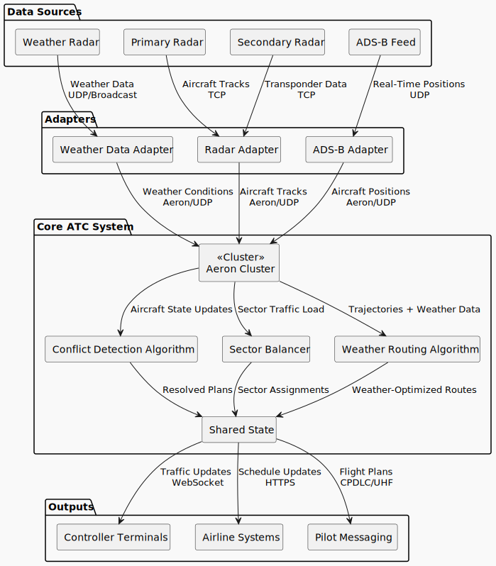

# AeroMesh
## Objective
We’re building a modern, distributed air traffic control (ATC) system designed to optimize flight safety and efficiency by leveraging real-time data processing and conflict detection. The system will use an Aeron cluster for high-throughput, low-latency communication across multiple components, enabling seamless interaction between aircraft, controllers, and routing systems.

## What’s Being Built
This project consists of several core components:

* **Aeron Cluster**: A high-performance, low-latency messaging system that will serve as the backbone for communication.
* **Conflict Detection Algorithm**: To assess and resolve conflicts between aircraft in real-time.
* **Weather Routing**: To optimize flight paths based on real-time weather data.
* **Sector Balancer**: To ensure balanced workload distribution across control sectors.

## Approach
We’ll begin by building the Aeron Cluster. This will be the foundation for all real-time data exchanges, handling communication between various adapters (weather, radar, ADS-B), core algorithms, and output systems. Once the Aeron cluster is established, we’ll incrementally integrate conflict detection, weather routing, and sector balancing to create a fully functional ATC system.

## Architectural Diagram
